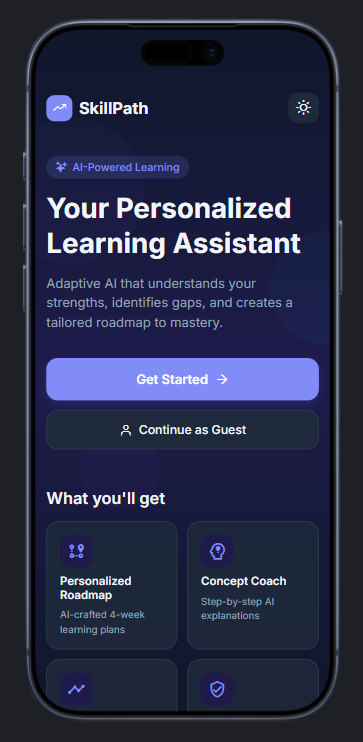
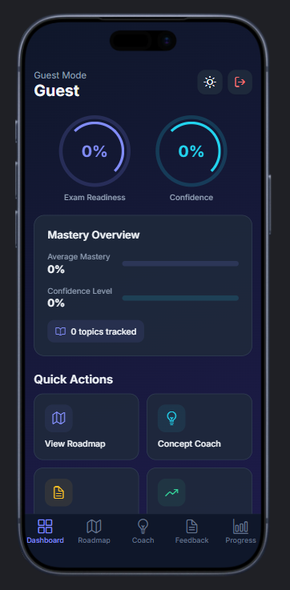
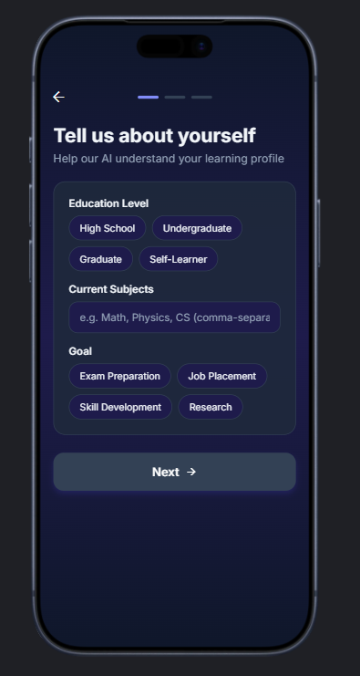
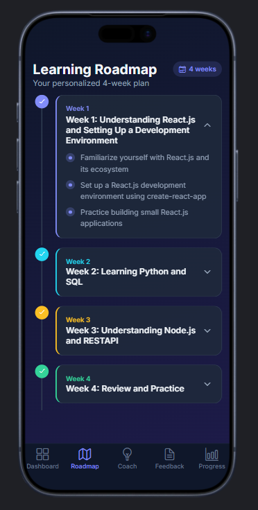
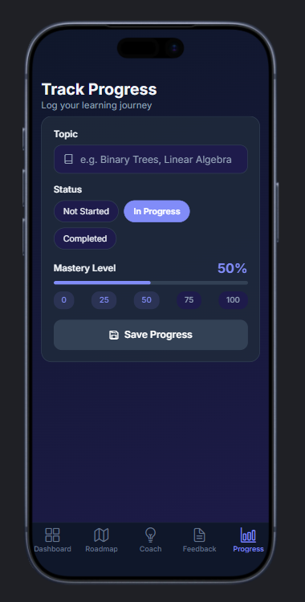
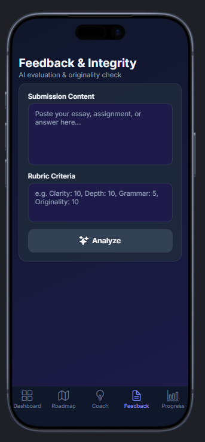

# SkillPath - AI-Powered Learning Assistant

## Introduction

SkillPath is an intelligent mobile application designed to personalize your learning journey through AI-driven guidance. By understanding your educational background, current subjects, and learning goals, SkillPath creates a tailored learning experience that adapts to your unique needs and aspirations.

## Project Overview

SkillPath revolutionizes the way individuals approach learning by leveraging artificial intelligence to provide personalized educational pathways. The application begins with a comprehensive user profiling system that captures essential information about your educational level, areas of study, and specific learning objectives.

### Application Interface

The SkillPath application features a modern, user-friendly interface designed to provide an engaging learning experience:

**Profile Setup Screen**: The welcome screen "Tell us about yourself" serves as the entry point where users provide their learning profile information. The interface features:

- **Education Level Selection**: Users can choose from High School, Undergraduate, Graduate, or Self-Learner options
- **Current Subjects Input**: A text field allows users to enter their current subjects (e.g., Math, Physics, CS)
- **Learning Goals**: Multiple goal options including Exam Preparation, Job Placement, Skill Development, and Research
- **Modern Dark Theme**: The app employs a sophisticated dark background with purple accent colors for selected options
- **Intuitive Navigation**: A prominent "Next" button with arrow icon guides users through the setup process

**Interactive Design Elements**: The application showcases thoughtful UX design with:

- **Visual Feedback**: Selected options are highlighted with purple backgrounds for clear visual confirmation
- **Responsive Touch Targets**: All interactive elements are sized appropriately for mobile interaction
- **Clean Typography**: High-contrast text ensures excellent readability on the dark background
- **Progressive Disclosure**: The step-by-step profile creation prevents overwhelming users with too much information at once

### Key Features

- **Personalized Learning Profiles**: The app gathers detailed information about your education level (High School, Undergraduate, Graduate, or Self-Learner), current subjects, and learning goals
- **AI-Powered Recommendations**: Based on your profile, the AI assistant provides customized learning paths and resource recommendations
- **Goal-Oriented Learning**: Whether you're preparing for exams, seeking job placement, developing new skills, or conducting research, SkillPath aligns its recommendations with your specific objectives
- **Modern User Interface**: Features a sleek, dark-themed design with intuitive navigation and visually appealing interactive elements

## Tech Stack

### Frontend & Mobile Development
- **React Native**: Cross-platform mobile application framework
- **Expo**: Development platform and toolkit for React Native
- **Expo Router**: File-based routing system for navigation

### UI/UX
- **React Native Components**: Native mobile UI components
- **Custom Styling**: Responsive design with dark theme and purple accent colors

### Development Tools
- **JavaScript/TypeScript**: Primary programming language
- **Expo CLI**: Command-line tools for development and building
- **Metro**: JavaScript bundler for React Native

### Platform Support
- **iOS**: Native iOS application support
- **Android**: Native Android application with adaptive icons
- **Web**: Web-based version with favicon support

## Getting Started

To run the SkillPath application locally:

1. Clone the repository
2. Install dependencies with `npm install`
3. Start the development server with `npm start` or `expo start`
4. Run the app on your preferred platform using the Expo Go app or simulator

## Future Enhancements

- Integration with popular learning platforms
- Real-time progress tracking and analytics
- Collaborative learning features
- Advanced AI tutoring capabilities

---

Developed by Parimi Gayatri